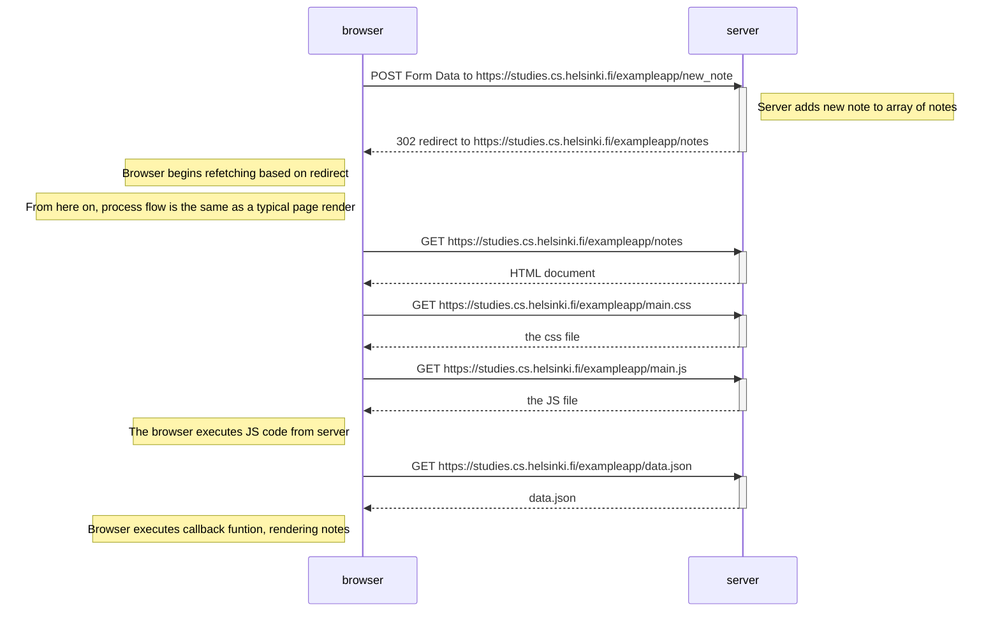

```mermaid
sequenceDiagram
    participant browser
    participant server

    browser->>server: POST Form Data to https://studies.cs.helsinki.fi/exampleapp/new_note
    activate server
    note right of server: Server adds new note to array of notes
    server-->>browser: 302 redirect to https://studies.cs.helsinki.fi/exampleapp/notes 
    deactivate server
    
    note left of browser: Browser begins refetching based on redirect
    note left of browser: From here on, process flow is the same as a typical page render
    
    browser->>server: GET https://studies.cs.helsinki.fi/exampleapp/notes
    activate server
    server-->>browser: HTML document
    deactivate server

    browser->>server: GET https://studies.cs.helsinki.fi/exampleapp/main.css
    activate server
    server-->>browser: the css file
    deactivate server

    browser->>server: GET https://studies.cs.helsinki.fi/exampleapp/main.js
    activate server
    server-->>browser: the JS file
    deactivate server

    Note left of browser: The browser executes JS code from server

    browser->>server: GET https://studies.cs.helsinki.fi/exampleapp/data.json
    activate server
    server-->>browser: data.json
    deactivate server

    note left of browser: Browser executes callback funtion, rendering notes
```